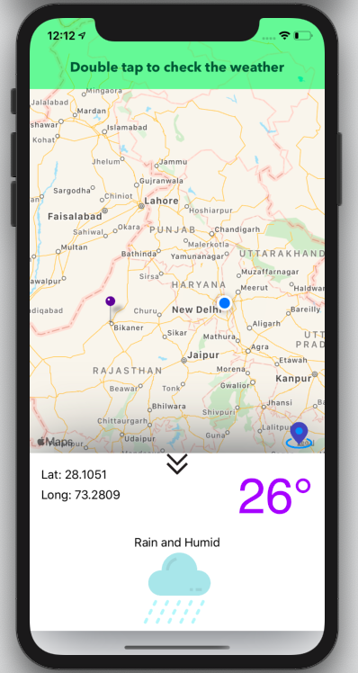

# Weather Application Assessment

As the name suggest it was an assessment of one startup. I was assigned to make this app in a short amount of time and I succesfully did it.

This app is basically an weather app which fetch information (like temperature, Latitude, Longitude) using api when user double taps on the map location and displays the Weather information in beautiful pull up view.


<p align="center">
  
</p>


## 🤝 Contributing

```bash
1. Fork the repository 
2. Do the desired changes (add/delete/modify)
3. Make a pull request
```

Pull requests are welcome. For major changes, please open an issue first to discuss what you would like to change.

## Author

👤 **Ankit Sharma**

 ✉️ *nkits9@gmail.com*
 - Linkedin: [@nkits9](https://www.linkedin.com/in/nkits9/)
 - Github: [@nkits9](https://github.com/nkits9)


